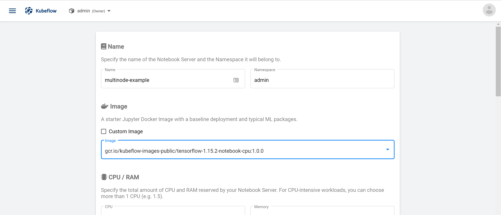
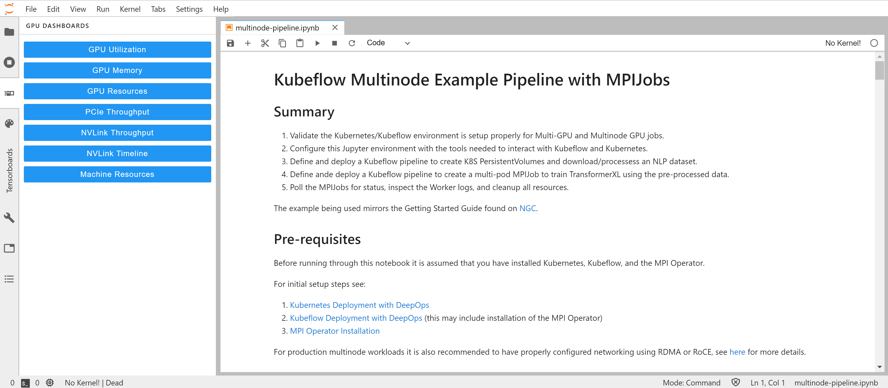

# Kubeflow Multinode Example Pipeline with MPIJobs

## Summary

1. Validate the Kubernetes/Kubeflow environment is setup properly for Multi-GPU and Multinode GPU jobs.
2. Configure this Jupyter environment with the tools needed to interact with Kubeflow and Kubernetes.
3. Define and deploy a Kubeflow pipeline to create K8S PersistentVolumes and download/processess an NLP dataset.
4. Define ande deploy a Kubeflow pipeline to create a multi-pod MPIJob to train TransformerXL using the pre-processed data.
5. Poll the MPIJobs for status, inspect the Worker logs, and cleanup all resources.

The example being used mirrors the Getting Started Guide found on [NGC](https://ngc.nvidia.com/catalog/resources/nvidia:transformerxl_for_tensorflow/quickStartGuide).

## Pre-requisites

Before running through this notebook it is assumed that you have installed Kubernetes, Kubeflow, and the MPI Operator.

For initial setup steps see:

1. [Kubernetes Deployment with DeepOps](https://github.com/NVIDIA/deepops/blob/master/docs/kubernetes-cluster.md) (this should include installation of the `nfs-client-provisioner`)
2. [Kubeflow Deployment with DeepOps](https://github.com/NVIDIA/deepops/blob/master/docs/kubeflow.md) (this may include installation of the MPI Operator)
3. [MPI Operator Installation](https://github.com/kubeflow/mpi-operator)

For production multinode workloads it is also recommended to have properly configured networking using RDMA or RoCE, see [here](https://github.com/NVIDIA/deepops/blob/master/docs/roce-perf-k8s.md) for more details.

### Running this notebook

This notebook can be run on any Kubeflow-compatible Jupyter Container (including the default Kubeflow containers) or can be launched on the same node where your Kubernetes cluster is running.

For best results, launch one of the default containers through the Kubeflow Notebook interface.



To begin copy the [notebook](multinode-pipeline.ipynb) to your running JupyterLab container.




### Debugging

It is possible that you may encounter an issue where the MPIJob is unable to launch a Worker Pod or a Launcher Pod. If after creating an MPIJob you encounter issues, there are a few places to look for logs.

The first place you will want to search is the MPI Operator Pod. This Pod is responsible for launching Workers and Launchers and will show any errors in parsing of your MPIJob YAML.


```sh
$ kubectl get pods -A | grep mpi-operator
kubeflow          mpi-operator-7b79884b54-q8t2n                               1/1     Running     1          4d20h
$ kubectl logs -n kubeflow mpi-operator-7b79884b54-q8t2n
...
```
> Note: the MPI Operator may run in a different namespace depending on installation method.

You may also want to verify that an MPIJob has been created:

```sh
$ kubectl get mpijobs -A
```

After that, all logs for the workers are collected by the Launcher:
```sh
$ kubectl logs -f mpi-example-Launcher-38j58g  multinode-example
```

### Namespaces

Depending on the version of Kubeflow that is deployed, it may be necessary to change the `pipeline_namespace` value to `kubeflow`. If the `MPIJobs` fail to find their data, re-run the notebook after changing the `pipeline_namespace` definition in the `MPIJob` YAML and at the top of the notebook to `kubeflow`. If this change must be made, the last two cells for deleting the resources and monitoring logs must be run from the command line, as the notebook may not have access.
